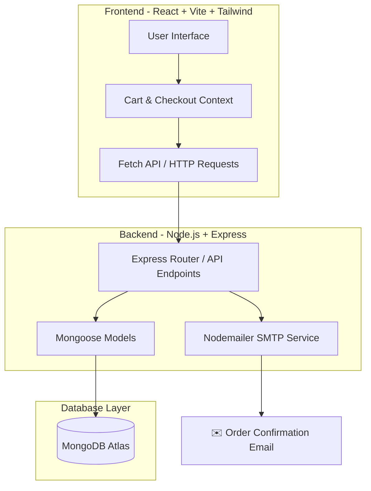

# 🛍️ Shopping Cart - Fullstack E-Commerce Platform

A complete full-stack online shopping platform built with the MERN stack (MongoDB, Express, React, Node.js) and Vite. The application features user registration, editable profiles, search, an interactive shopping cart, checkout, and email receipts powered by Nodemailer.

---

<p align="center">
  
  &nbsp;
  
  &nbsp;
  
  &nbsp;
  
  &nbsp;
  
  &nbsp;
  
</p>

---

## 🛠️ System Architecture

This full-stack application splits duties between client-side rendering and a REST API:



---

## 🌟 Key Features

*   **User Accounts:** User registration and login persisted in a MongoDB database.
*   **Editable Profiles:** Profile pages listing name, username, email, mobile, and age with full edit and log-out support.
*   **Catalog Browsing:** 50+ products across multiple categories with details including specifications (RAM, storage, characteristics).
*   **Interactive Shopping Cart:** Interactive cart with dynamic quantity updates, aggregate totals, and quick Checkout/Buy Now triggers.
*   **Search Engine:** Accessible header search bar with a clickable icon to quickly query items.
*   **Automated Receipts:** Emails transaction summaries to both the customer and admin on successful checkouts using Nodemailer SMTP.
*   **Responsive UI:** Mobile-first layout styled using Bootstrap 5 and Tailwind CSS.

---

## 📂 Project Directory Structure

```text
Ecommerce/
│
├── backend/       # Node.js + Express API server and DB schemas
│   ├── models/    # Mongoose schemas (Users, Products, Orders)
│   ├── server.js  # Main Express application entrypoint
│   └── package.json
│
├── frontend/      # React + Vite client-side single page app (SPA)
│   ├── src/       # Components, Contexts, Pages, and Assets
│   ├── index.html # App HTML shell
│   └── package.json
│
└── README.md      # Project documentation and developer guide
```

---

## 🚀 How to Run Locally

### Prerequisites
*   [Node.js](https://nodejs.org/) installed locally (v18+ recommended)
*   A running [MongoDB Atlas](https://www.mongodb.com/cloud/atlas) cluster or local MongoDB instance
*   A Gmail account with an [App Password](https://support.google.com/accounts/answer/185833) (required for Nodemailer to send emails)

---

### Step 1: Backend Setup

1.  Navigate to the `backend/` directory:
    ```bash
    cd backend
    ```
2.  Install dependencies:
    ```bash
    npm install
    ```
3.  Create a `.env` file in the `backend/` directory:
    ```env
    PORT=5000
    MONGO_URI=your_mongodb_connection_string
    GMAIL_USER=your_email@gmail.com
    GMAIL_PASS=your_app_password
    ```
4.  Start the backend API server:
    ```bash
    # For development (with nodemon):
    npm run dev
    # For production:
    npm start
    ```

---

### Step 2: Frontend Setup

1.  Open a new terminal window and navigate to the `frontend/` directory:
    ```bash
    cd frontend
    ```
2.  Install client-side dependencies:
    ```bash
    npm install
    ```
3.  Start the frontend development server:
    ```bash
    npm run dev
    ```
4.  Open [http://localhost:5173](http://localhost:5173) in your browser to view the application.

---

## 💡 Future Enhancements

- [ ] **Secure Payment Gateways:** Integrate Stripe or Razorpay SDKs for actual financial checkouts.
- [ ] **JWT Authentication:** Upgrade sessions to JSON Web Tokens (JWT) for secure authentication.
- [ ] **Admin Dashboard:** Build a dedicated administration panel to add/edit products, manage stock levels, and review client order sheets.
- [ ] **Persistent State:** Sync shopping cart data to MongoDB or localStorage so it survives page reloads.
